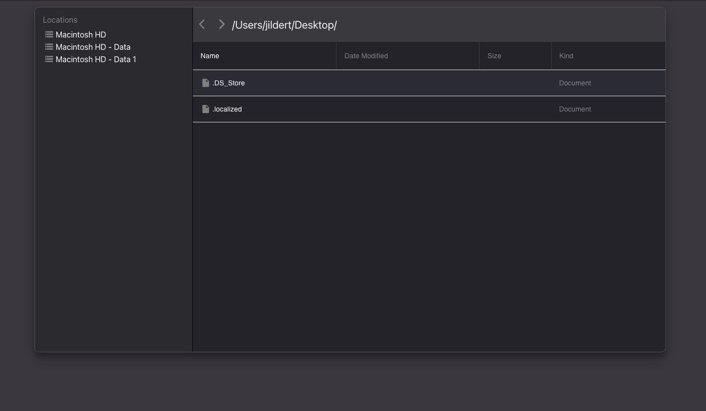

# A React File Browser Component
A reusable react component for browsing files in the web browser. 

  

# How to run the project
1. Install packages with:  
    `yarn install` 
       or 
     `npm install`

2. Run frontend app and backend (node) app with (backend is MAC OS only):    
    `yarn start` 
       or 
     `npm run start`

    
3. Cool stuff

 

# API
Check src/example.js for the example usage of this component.
 
## Properties
| Name | Type | Description | Example |
|-|-|-|-|
| currentDirectory | string | The current directory of the file browser (displayed in header) | /Users/ |
| currentFiles | array of objects with keys: name, isFolder, dateModified, size, kind | The current files that are shown in the file browser | [{ name: 'example.pdf', isFolder: false, dateModified: 'Mon 7 Jun 2021', size: '123 KB', kind: 'Document' }] |
| locations | array of objects with keys: device, label | The available locations (drives). Shown in the left side bar. | [{ device: 'C:', label: 'WinDrive' }] |
| nextEnabled | bool | Next button in header is enabled or not | true |
| previousEnabled | bool | Previous button in header is enabled or not | true |
| onFileClick | callback func with parameter: file | Callback for when a file is clicked in the table | (file) => console.log(file)  |
| onLocationClick | callback func with parameter: location | Callback for when a drive location is clicked | (location) => console.log(location) |
| onNextClick | callback func | Callback for when next button is clicked | () => console.log('next clicked') |
| onPreviousClick | callback func | Callback for when previous buttin is clicked | () => console.log('previous is clicked') |